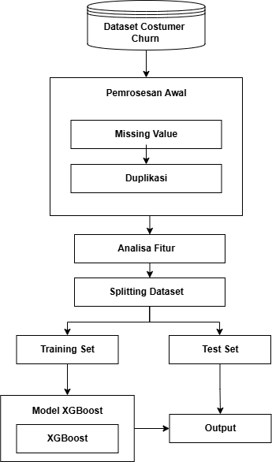

#### Nama     : Restu Lestari Mulianingrum

#### NIM      : A11.2022.14668

#### Kelompok : A11.4413
# **PREDIKSI CHURN DI PERUSAHAAN TELEKOMUNIKASI DENGAN METODE XGBOOST**
## **Ringkasan Project**
Proyek ini berfokus pada analisis churn pelanggan di industri telekomunikasi. Churn pelanggan adalah fenomena di mana pelanggan berhenti menggunakan layanan dari penyedia layanan tertentu. Mengidentifikasi faktor-faktor yang menyebabkan churn dan mengembangkan model prediksi dapat membantu perusahaan telekomunikasi mengurangi tingkat churn dan meningkatkan retensi pelanggan.
## **Permasalahan**
1. **Identifikasi Faktor Penyebab Churn**: Menentukan variabel-variabel utama yang berkontribusi terhadap churn pelanggan.
2. **Prediksi Churn**: Mengembangkan model yang dapat memprediksi apakah seorang pelanggan akan churn atau tidak berdasarkan data historis.
3. **Intervensi yang Efektif**: Menemukan strategi intervensi yang efektif untuk mengurangi churn berdasarkan hasil analisis dan prediksi.

## **Tujuan yang Akan Dicapai**

1. **Analisis Deskriptif**: Menganalisis data pelanggan untuk memahami karakteristik umum dan pola-pola yang berkaitan dengan churn.
2. **Pengembangan Model Prediksi**: Membangun model machine learning untuk memprediksi churn pelanggan.
3. **Rekomendasi Strategi**: Memberikan rekomendasi strategis berdasarkan hasil analisis dan model prediksi untuk mengurangi churn pelanggan.

## **Model / Alur Penyelesaian**

1. **Pra-pemrosesan Data**: Membersihkan dan mempersiapkan data untuk analisis lebih lanjut, termasuk penanganan data yang hilang dan normalisasi.
2. **Analisis Eksploratif**: Melakukan analisis eksploratif untuk memahami karakteristik data dan mengidentifikasi pola-pola yang signifikan.
3. **Pengembangan Model**:
   - **Pemilihan Model**: Memilih algoritma machine learning yang sesuai. Untuk proyek ini, kita akan menggunakan **XGBoost (Extreme Gradient Boosting)**.
   - **Pelatihan Model**: Melatih model menggunakan data pelatihan dan melakukan validasi silang untuk memastikan kinerja yang baik.
   - **Evaluasi Model**: Mengevaluasi model menggunakan metrik seperti akurasi, precision, recall, dan F1-score.
4. **Prediksi dan Interpretasi (Output)**: Menggunakan model untuk memprediksi churn pada data baru dan menginterpretasikan hasil prediksi untuk mengidentifikasi faktor-faktor risiko.

## **Memuat Data dan Mengimpor Modul**

# Mengimpor paket-paket yang diperlukan
import pandas as pd
import numpy as np
# Mengimpor paket visualisasi
import matplotlib.pyplot as plt
%matplotlib inline
import seaborn as sns
# membaca data

telecom_df = pd.read_csv('Telecom_Churn.csv')

print('Data berhasil terbaca!')
telecom_df.head()
telecom_df.info()
# **Memahami Lebih Lanjut Data**
# Melihat data dari 5 baris teratas untuk mendapatkan gambaran tentang data
telecom_df.head(5)
# Melihat data dari 5 baris terbawah untuk mendapatkan gambaran tentang data
telecom_df.tail(5)
# Mendapatkan bentuk dataset dengan jumlah baris dan kolom
print(telecom_df.shape)
# Mendapatkan semua kolom
print("Features of the dataset:")
telecom_df.columns
### **Rincian Fitur:**

**STATE:**
51 Kode Negara

**Account Length:**
Durasi Akun

**Area Code:**
Kode Nomor Area yang mencakup beberapa Negara Bagian

**International Plan:**
"Yes" menunjukkan ada Langganan Internasional dan "No" menunjukkan tidak ada langganan untuk Rencana Internasional

**Voice Mail Plan:**
"Yes" menunjukkan ada Rencana Suara dan "No" menunjukkan tidak ada langganan untuk Rencana Suara

**Number vmail messages:**
Jumlah Pesan Suara yang berkisar dari 0 hingga 50

**Total day minutes:**
Jumlah Total Menit yang Dihabiskan di Pagi Hari

**Total day calls:**
Jumlah Total Panggilan yang Dilakukan di Pagi Hari

**Total day charge:**
Total Biaya yang Dibebankan kepada Pelanggan di Pagi Hari

**Total eve minutes:**
Jumlah Total Menit yang Dihabiskan di Malam Hari

**Total eve calls:**
Jumlah Total Panggilan yang Dilakukan di Malam Hari

**Total eve charge:**
Total Biaya yang Dibebankan kepada Pelanggan di Malam Hari

**Total night minutes:**
Jumlah Total Menit yang Dihabiskan di Malam Hari

**Total night calls:**
Jumlah Total Panggilan yang Dilakukan di Malam Hari

**Total night charge:**
Total Biaya yang Dibebankan kepada Pelanggan di Malam Hari

**Customer service calls:**
Jumlah Panggilan Layanan Pelanggan yang Dilakukan oleh Pelanggan

**Churn:**
Churn Pelanggan, "True" berarti pelanggan yang churn, "False" berarti pelanggan yang tetap

# Mendapatkan tipe data dari semua kolom
telecom_df.dtypes
#Memeriksa detail dataset
telecom_df.info()
#Kita melihat bahwa terdapat 3333 entri dan tidak ada nilai yang hilang
telecom_df.nunique()
# Melihat deskripsi dataset untuk mendapatkan wawasan tentang data
telecom_df.describe(include='all')
# Mencetak jumlah nilai "True" dan "False" pada fitur 'Churn
print(telecom_df.Churn.value_counts())
## **Pra-pemrosesan Data**
#### **Memeriksa Nilai yang Hilang dan Duplikat**
# Memeriksa jumlah nilai yang hilang di setiap kolom
print(telecom_df.isna().sum())
print(telecom_df.isnull().sum())
# Membuat DataFrame untuk nilai yang hilang
missing = pd.DataFrame((telecom_df.isnull().sum()) * 100 / telecom_df.shape[0], columns=['Persentase'])
missing.reset_index(inplace=True)
missing.columns = ['Fitur', 'Persentase']

# Membuat plot
plt.figure(figsize=(16, 5))
ax = sns.pointplot(x='Fitur', y='Persentase', data=missing)
plt.xticks(rotation=90, fontsize=7)
plt.title("Persentase Nilai yang Hilang")
plt.ylabel("PERSENTASE")
plt.show()

# Mengecek nilai duplikat
jumlah_duplikat = len(telecom_df[telecom_df.duplicated()])

print(f"Jumlah nilai duplikat: {jumlah_duplikat}")
# Deskripsi Dataset

**Saat ini, dataset memiliki:**

- **3333 baris dan 20 kolom.**

- **1 tipe data boolean**: `churn`

- **8 tipe data float**

- **8 tipe data integer**

- **3 tipe data objek**: Kolom dengan nilai kategorikal

- **Tidak ada nilai yang hilang**, sehingga tidak perlu melakukan imputasi nilai yang hilang.

- **Tidak ada nilai duplikat**.

#### **Mengubah Kolom Target 'Churn' menjadi Numerik**
# Mengubah variabel target 'Churn' menjadi numerik menggunakan replace
telecom_df['Churn'] = telecom_df['Churn'].replace({True: 1, False: 0})
# Mengonversi kolom kategorikal menjadi numerik jika ada
X = pd.get_dummies(telecom_df.drop('Churn', axis=1), drop_first=True)
y = telecom_df['Churn']
# Menampilkan beberapa baris pertama dataset untuk memastikan perubahan
print("Data setelah mengubah variabel target 'Churn':")
print(telecom_df.head())
# **Analisis Data Eksplorasi dari Dataset**
# Menganalisis Variabel Dependen `churn`

Variabel `churn` adalah variabel dependen dalam dataset ini, yang menunjukkan apakah pelanggan telah berhenti menggunakan layanan atau produk. Berikut adalah beberapa analisis yang dapat dilakukan untuk memahami variabel ini:
# Menampilkan nilai unik di kolom "Churn"
unique_values = telecom_df["Churn"].unique()

print("Nilai unik di kolom 'Churn':", unique_values)
# Menampilkan jumlah nilai True dan False di kolom 'Churn'
print(telecom_df.Churn.value_counts())
pastel_colors = ['#FFB3E6', '#FFCC99']

# Membuat pie chart untuk analisis churn
telecom_df['Churn'].value_counts().plot.pie(
    explode=[0.05, 0.05],        # Mengatur jarak potongan dari pusat
    autopct='%1.1f%%',            # Menampilkan persentase pada potongan
    startangle=90,                # Memutar diagram untuk penampilan yang lebih baik
    shadow=True,                  # Menambahkan bayangan pada diagram
    figsize=(8, 8),               # Mengatur ukuran gambar
    colors=pastel_colors          # Mengatur warna pastel
)

plt.title('Diagram Lingkaran untuk Churn') # Menambahkan judul
plt.ylabel('')                      # Menghapus label sumbu y untuk pie chart
plt.show()

# Data untuk churn
data = telecom_df['Churn'].value_counts()

# Mengatur bagian yang akan dikeluarkan dari pusat
explode = (0, 0.2)

# Membuat diagram donut
plt.pie(
    data,
    explode=explode,                 # Mengatur jarak potongan dari pusat
    autopct='%1.1f%%',               # Menampilkan persentase pada potongan
    shadow=True,                     # Menambahkan bayangan pada diagram
    radius=2.0,                      # Mengatur radius luar dari donut
    labels=['Not churned customer', 'Churned customer'],  # Label potongan
    colors=['teal', 'lime']     # Warna untuk setiap potongan
)

# Menambahkan lingkaran putih di tengah untuk membuat efek donut
circle = plt.Circle((0, 0), 1, color='white')
p = plt.gcf()
p.gca().add_artist(circle)

# Menambahkan judul
plt.title('Diagram Donut untuk Churn')

# Menampilkan plot
plt.show()

import seaborn as sns
import matplotlib.pyplot as plt

# Membuat countplot untuk menganalisis churn
plt.figure(figsize=(8, 6))
sns.countplot(x=telecom_df.Churn, palette='pastel')

# Menambahkan judul dan label
plt.title('Distribusi Churn')
plt.xlabel('Churn')
plt.ylabel('Jumlah')

# Mengatur label sumbu x jika nilai churn adalah 0 dan 1
plt.xticks(ticks=[0, 1], labels=['Tidak Churn', 'Churn'])

# Menampilkan plot
plt.show()
# Analisis Fitur dan Korelasi dengan Churn

Setelah menganalisis kolom `churn`, kami menemukan bahwa hampir 15% pelanggan mengalami churn. Selanjutnya, mari kita lihat apa yang dikatakan fitur lainnya dan hubungan apa yang kita dapatkan setelah dikorelasikan dengan churn.

## 1. Korelasi antara `Churn` dan Fitur Numerik

Kita akan menghitung korelasi antara `churn` dan fitur numerik lainnya untuk melihat hubungan antara churn dan fitur-fitur tersebut.

## Menganalisis Kolom `State`
# Mencetak jumlah nilai unik di kolom 'State'
unique_states = telecom_df['State'].nunique()
print(f"Jumlah nilai unik di kolom 'State': {unique_states}")
# Mengatur gaya tampilan seaborn
sns.set(style="darkgrid")

# Membuat figure dengan ukuran yang sesuai
plt.figure(figsize=(15, 8))

# Membuat countplot untuk membandingkan churn dengan negara bagian
ax = sns.countplot(x='State', hue='Churn', data=telecom_df, palette='pastel')

# Menambahkan judul dan label
plt.title('Perbandingan Churn Berdasarkan Negara Bagian')
plt.xlabel('Negara Bagian')
plt.ylabel('Jumlah')
plt.xticks(rotation=90)  # Memutar label sumbu x jika perlu

# Menampilkan plot
plt.show()
# Mendapatkan daftar negara bagian unik dan rata-rata churn per negara bagian
s1 = telecom_df['State'].unique()
s2 = telecom_df.groupby(['State'])['Churn'].mean()

# Mengatur ukuran gambar
plt.rcParams['figure.figsize'] = (18, 7)

# Membuat grafik garis untuk tingkat churn berdasarkan negara bagian
plt.plot(s1, s2, color='r', marker='o', linewidth=2, markersize=12)

# Menambahkan judul dan label sumbu
plt.title("Tingkat Churn Berdasarkan Negara Bagian", fontsize=20)
plt.xlabel('Negara Bagian', fontsize=15)
plt.ylabel('Tingkat Churn', fontsize=15)

# Menampilkan plot
plt.xticks(rotation=90)  # Memutar label sumbu x untuk keterbacaan
plt.show()

# Mengatur ukuran gambar
plt.rcParams['figure.figsize'] = (12, 7)

# Menghitung persentase churn per negara bagian dan memilih 6 negara bagian dengan churn tertinggi
top_churn_states = (telecom_df.groupby(['State'])['Churn'].mean() * 100).sort_values(ascending=False).head(6)

# Mengatur warna pastel dari Seaborn
pastel_colors = sns.color_palette("pastel", n_colors=6)

# Membuat grafik batang dengan warna pastel
top_churn_states.plot.bar(color=pastel_colors)

# Menambahkan judul dan label sumbu
plt.title("Negara Bagian dengan Persentase Churn Tertinggi", fontsize=20)
plt.xlabel('Negara Bagian', fontsize=15)
plt.ylabel('Persentase Churn (%)', fontsize=15)

# Menampilkan plot
plt.show()
# Menghitung tabel kontingensi antara 'State' dan 'Churn'
State_data = pd.crosstab(telecom_df["State"], telecom_df["Churn"])

# Menghitung persentase churn menggunakan iloc
State_data['Percentage_Churn'] = State_data.apply(lambda x: x.iloc[1] * 100 / (x.iloc[0] + x.iloc[1]), axis=1)

# Menampilkan hasil
print(State_data)

# Mengelompokkan data berdasarkan 'State', menghitung rata-rata churn, dan mengurutkan hasil secara menurun
top_10_churn_states = telecom_df.groupby(['State'])['Churn'].mean().sort_values(ascending=False).head(10)

# Menampilkan 10 negara bagian dengan persentase churn tertinggi
print(top_10_churn_states)
## Analisis Tingkat Churn Berdasarkan Negara Bagian

Dalam dataset ini, terdapat **51 negara bagian** yang memiliki tingkat churn yang berbeda-beda. Berdasarkan analisis, beberapa negara bagian dengan tingkat churn tertinggi adalah:

- **California (CA)**
- **New Jersey (NJ)**
- **Texas (TX)**
- **Maryland (MD)**
- **South Carolina (SC)**
- **Michigan (MI)**

Negara bagian tersebut memiliki tingkat churn yang lebih dari **21%**.

### Kemungkinan Penyebab Tingkat Churn Tinggi

Salah satu kemungkinan penyebab tingginya tingkat churn di negara bagian tertentu bisa jadi adalah **jaringan seluler yang kurang memadai**. Masalah seperti cakupan jaringan yang buruk, kecepatan internet yang lambat, atau layanan pelanggan yang kurang memuaskan mungkin menyebabkan pelanggan memilih untuk berpindah ke penyedia layanan lain.

**Catatan:** Menganalisis lebih lanjut tentang faktor-faktor seperti kepuasan pelanggan, kualitas layanan, dan cakupan jaringan di negara bagian dengan churn tinggi dapat memberikan wawasan tambahan untuk strategi perbaikan.

## Analisis Kolom `Area Code`

Untuk menganalisis kolom "Area Code" dan menghitung persentase churn berdasarkan kode area, kita dapat menggunakan tabel kontingensi dan menghitung persentase churn untuk setiap kode area. Berikut adalah kode untuk melakukan perhitungan ini:
# Menghitung tabel kontingensi antara 'Area code' dan 'Churn'
Area_code_data = pd.crosstab(telecom_df["Area code"], telecom_df["Churn"])

# Menghitung persentase churn menggunakan iloc
Area_code_data['Percentage_Churn'] = Area_code_data.apply(lambda x: x.iloc[1] * 100 / (x.iloc[0] + x.iloc[1]), axis=1)

# Menampilkan hasil
print(Area_code_data)
sns.set(style="darkgrid")

# Menentukan palet warna pastel
pastel_palette = sns.color_palette("pastel")

# Membuat grafik countplot untuk kode area dan churn
plt.figure(figsize=(12, 6))  # Menentukan ukuran gambar
ax = sns.countplot(x='Area code', hue='Churn', data=telecom_df, palette=pastel_palette)

# Menambahkan judul dan label sumbu
plt.title('Distribusi Churn Berdasarkan Kode Area', fontsize=16)
plt.xlabel('Kode Area', fontsize=14)
plt.ylabel('Jumlah Pelanggan', fontsize=14)

# Menampilkan plot
plt.show()
Dalam data yang dianalisis, terdapat hanya **3 nilai unik** untuk kode area, yaitu **408**, **415**, dan **510**. Persentase churn untuk ketiga kode area ini hampir sama, yang menunjukkan bahwa tingkat churn tidak berbeda secara signifikan antara kode area yang berbeda.

### Kesimpulan

- **Kode Area:** Hanya ada tiga kode area unik dalam dataset.
- **Tingkat Churn:** Persentase churn untuk kode area 408, 415, dan 510 hampir serupa.

Dari analisis ini, tampaknya **tidak ada hubungan signifikan** antara kode area dan churn. Dengan kata lain, kode area tampaknya tidak mempengaruhi keputusan pelanggan untuk meninggalkan operator. Faktor lain mungkin lebih berperan dalam menentukan tingkat churn.
## Analisis Kolom `Account Length`
# Memisahkan pelanggan churn dan tidak churn
churn_df = telecom_df[telecom_df["Churn"] == True]
not_churn_df = telecom_df[telecom_df["Churn"] == False]
# Membuat histogram distribusi panjang akun
sns.histplot(telecom_df['Account length'], kde=True, color='teal')
# Membuat histogram distribusi panjang akun
sns.histplot(telecom_df['Account length'], color='yellow', label='All', kde=True)
sns.histplot(churn_df['Account length'], color='red', label='Churned', kde=True)
sns.histplot(not_churn_df['Account length'], color='green', label='Not churned', kde=True)

# Menambahkan judul, label sumbu, dan legend
plt.title('Perbandingan Panjang Akun antara Pelanggan Churn dan Tidak Churn')
plt.xlabel('Panjang Akun')
plt.ylabel('Frekuensi')
plt.legend()

# Menampilkan plot
plt.show()
***Setelah menganalisis berbagai aspek dari kolom "account length" tidak menunjukkan hubungan yang signifikan dengan churn, langkah berikutnya adalah mengeksplorasi fitur lain dalam dataset untuk mencari pola atau hubungan yang mungkin lebih relevan. Berikut adalah beberapa langkah dan fitur yang bisa kamu analisis lebih lanjut:***
## Analisis Kolom `International Plan`
counts = telecom_df['International plan'].value_counts()
print("Jumlah pelanggan dengan rencana internasional:")
print(counts)
unique_values = telecom_df["International plan"].unique()
print(unique_values)
# Menghitung frekuensi gabungan antara 'International plan' dan 'Churn'
International_plan_data = pd.crosstab(telecom_df["International plan"], telecom_df["Churn"])

# Menambahkan kolom untuk persentase churn
International_plan_data['Percentage Churn'] = International_plan_data.apply(
    lambda x: x.iloc[1] * 100 / (x.iloc[0] + x.iloc[1]),
    axis=1
)

print(International_plan_data)
# Menghitung frekuensi dari 'International plan'
data = telecom_df['International plan'].value_counts()

# Mengatur 'explode' untuk memberikan efek pada bagian tertentu dari pie chart
explode = (0, 0.2)

# Membuat pie chart dengan 'donut' plot
plt.pie(data, explode=explode, autopct='%1.1f%%', shadow=True, radius=1.2, labels=['No', 'Yes'], colors=['skyblue', 'orange'])

# Menambahkan lingkaran putih di tengah untuk efek donut
circle = plt.Circle((0, 0), 0.7, color='white')
p = plt.gcf()
p.gca().add_artist(circle)

# Menambahkan judul
plt.title('Donut Plot for International Plan')

# Menampilkan plot
plt.show()
# Membuat countplot untuk 'International plan' dengan pemisahan berdasarkan 'Churn'
sns.countplot(x='International plan', hue='Churn', data=telecom_df)

# Menambahkan judul dan label
plt.title('Count Plot of International Plan vs Churn')
plt.xlabel('International Plan')
plt.ylabel('Count')

# Menampilkan plot
plt.show()
***Dari data di atas, kita mendapatkan informasi sebagai berikut:***

- ***Ada 3010 pelanggan yang tidak memiliki rencana internasional.***
- ***Ada 323 pelanggan yang memiliki rencana internasional.***

- ***Di antara pelanggan yang memiliki rencana internasional, 42,4% di antaranya churn.***
- ***Sementara itu, di antara pelanggan yang tidak memiliki rencana internasional, hanya 11,4% yang churn.***

***Jadi, secara umum, pelanggan yang membeli rencana internasional cenderung mengalami churn dalam jumlah yang lebih besar.***

***Ini mungkin disebabkan oleh masalah konektivitas atau biaya panggilan yang tinggi.***
## Analisis Kolom `Voice Mail Plan`
# Menampilkan nilai unik dari kolom "Voice mail plan"
telecom_df["Voice mail plan"].unique()
# Menghitung data crosstab antara rencana voicemail dan churn
Voice_mail_plan_data = pd.crosstab(telecom_df["Voice mail plan"], telecom_df["Churn"])

# Menambahkan kolom untuk persentase churn dengan menggunakan iloc
Voice_mail_plan_data['Percentage Churn'] = Voice_mail_plan_data.apply(lambda x: x.iloc[1] * 100 / (x.iloc[0] + x.iloc[1]), axis=1)

# Menampilkan hasil
print(Voice_mail_plan_data)
# Menghitung jumlah nilai unik dalam kolom 'Voice mail plan'
data = telecom_df['Voice mail plan'].value_counts()

# Membuat plot donut
explode = (0, 0.2)  # Mempercantik plot dengan meledakkan potongan kedua
plt.pie(data, 
        explode=explode, 
        autopct='%1.1f%%', 
        startangle=90, 
        shadow=True, 
        radius=2.0, 
        labels=['NO', 'YES'], 
        colors=['skyblue', 'red'])

# Menambahkan lingkaran putih di tengah untuk membuat efek donut
circle = plt.Circle((0, 0), 1, color='white')
p = plt.gcf()
p.gca().add_artist(circle)

# Menambahkan judul pada plot
plt.title('Donut Plot untuk Rencana Voicemail')

# Menampilkan plot
plt.show()
# Menghasilkan countplot untuk kolom 'Voice mail plan' dan 'Churn'
sns.countplot(x='Voice mail plan', hue='Churn', data=telecom_df)

# Menambahkan judul dan label pada plot
plt.title('Distribusi Churn Berdasarkan Rencana Voicemail')
plt.xlabel('Rencana Voicemail')
plt.ylabel('Jumlah Pelanggan')

# Menampilkan plot
plt.show()
***Seperti yang kita lihat, tidak ada hubungan yang jelas antara rencana voicemail dan churn, sehingga kita tidak dapat menarik kesimpulan yang jelas dari data ini. Oleh karena itu, mari kita lanjutkan ke fitur voicemail berikutnya, yaitu jumlah pesan suara. Kita akan melihat apa yang dapat diberikan oleh fitur ini kepada kita.***
## Analisis kolom `Number vmail messages`
# Tampilkan nilai unik dari kolom 'Number vmail messages'
telecom_df['Number vmail messages'].unique()
# Menampilkan jumlah kemunculan setiap nilai di kolom 'Number vmail messages'
telecom_df['Number vmail messages'].value_counts()
# Menampilkan ringkasan statistik dari kolom 'Number vmail messages'
telecom_df['Number vmail messages'].describe()
# Membuat diagram distribusi untuk kolom 'Number vmail messages'
sns.displot(telecom_df['Number vmail messages'], kde=True, color='teal')

# Menambahkan judul
plt.title('Distribusi Jumlah Pesan Suara')

# Menampilkan plot
plt.show()
# Membuat boxplot untuk 'Number vmail messages' berdasarkan churn
fig = plt.figure(figsize=(10, 8))
telecom_df.boxplot(column='Number vmail messages', by='Churn')

# Menambahkan judul utama dan judul sumbu
fig.suptitle('Distribusi Jumlah Pesan Suara Berdasarkan Churn', fontsize=14, fontweight='bold')
plt.title('')  # Menghapus judul default dari boxplot
plt.xlabel('Churn')
plt.ylabel('Jumlah Pesan Suara')

# Menampilkan plot
plt.show()
***Setelah menganalisis data fitur pesan suara di atas, kami mendapatkan wawasan bahwa ketika jumlah pesan suara melebihi 20, maka kemungkinan terjadinya churn meningkat.***

***Oleh karena itu, perlu dilakukan perbaikan pada kualitas pesan suara.***

## Analisis kolom `Customer service calls`
# Menampilkan data dari 'Customer service calls'
telecom_df['Customer service calls'].value_counts()
# Menghitung Persentase Churn Berdasarkan Jumlah Panggilan Layanan Pelanggan
Customer_service_calls_data = pd.crosstab(telecom_df['Customer service calls'], telecom_df["Churn"])

# Menghitung persentase churn
Customer_service_calls_data['Percentage_Churn'] = Customer_service_calls_data.apply(
    lambda x: x.iloc[1] * 100 / (x.iloc[0] + x.iloc[1]),
    axis=1
)

print(Customer_service_calls_data)
# Plot countplot untuk menganalisis 'Customer service calls' vs 'Churn'
sns.countplot(x='Customer service calls', hue='Churn', data=telecom_df)
plt.title('Jumlah Panggilan Layanan Pelanggan vs Churn')
plt.xlabel('Jumlah Panggilan Layanan Pelanggan')
plt.ylabel('Jumlah')
plt.legend(title='Churn')
plt.show()
Dari analisis di atas, dapat diamati bahwa:

- **Pengaruh Layanan Pelanggan:** Sebagian besar pelanggan cenderung meninggalkan operator karena layanan pelanggan yang buruk.
- **Tingkat Churn Tinggi:** Data menunjukkan bahwa pelanggan yang menelepon pusat layanan sebanyak 5 kali atau lebih memiliki persentase churn yang lebih tinggi dari 60%.
- **Panggilan Pertama yang Tidak Memadai:** Pelanggan yang hanya menelepon sekali juga memiliki tingkat churn yang tinggi, menunjukkan bahwa masalah mereka mungkin tidak terselesaikan pada percakapan pertama.

### Rekomendasi

Operator harus bekerja untuk meningkatkan kualitas layanan panggilan pelanggan untuk mengurangi tingkat churn dan meningkatkan kepuasan pelanggan.
### Analisis Durasi Semua Panggilan, Jumlah Semua Panggilan, dan Biaya Semua Panggilan

Karena dataset ini berisi data numerik dan kita ingin menganalisis hubungan dengan churn yang merupakan data kategorikal, kita akan menggunakan beberapa metode statistik dan visualisasi berikut:

1. **Rata-rata dan Median**: Menghitung rata-rata dan median untuk melihat kecenderungan pusat dari data numerik terkait churn.

2. **Box Plot**: Menggunakan box plot untuk mengidentifikasi sebaran data, mendeteksi nilai pencilan, dan membandingkan distribusi antara kategori churn dan tidak churn.

### Langkah Analisis:

1. **Menghitung Rata-rata dan Median**
   - Rata-rata dan median memberikan gambaran tentang kecenderungan pusat dari durasi panggilan, jumlah panggilan, dan biaya panggilan untuk pelanggan yang churn dan tidak churn.

2. **Box Plot**
   - Menggunakan box plot untuk visualisasi distribusi data numerik antara pelanggan yang churn dan tidak churn. Box plot akan membantu dalam memahami perbedaan distribusi antara kedua kelompok dan mendeteksi nilai ekstrim yang mungkin mempengaruhi churn.

Mari kita lakukan analisis ini untuk setiap fitur numerik:

# Menampilkan Rata-rata Jumlah Panggilan Harian untuk Pelanggan yang Churn dan Tidak Churn
print(telecom_df.groupby(["Churn"])['Total day calls'].mean())
# Menampilkan Rata-rata Durasi Panggilan Harian untuk Pelanggan yang Churn dan Tidak Churn
print(telecom_df.groupby(["Churn"])['Total day minutes'].mean())
# Menampilkan Rata-rata Biaya Panggilan Harian untuk Pelanggan yang Churn dan Tidak Churn
print(telecom_df.groupby(["Churn"])['Total day charge'].mean())
# Menampilkan hubungan antara Total Day Minutes dan Total Day Charge menggunakan scatter plot
sns.scatterplot(x="Total day minutes", y="Total day charge", hue="Churn", data=telecom_df, palette='hls')

# Menambahkan judul dan label sumbu
plt.title('Hubungan antara Total Menit Panggilan Harian dan Total Biaya Panggilan Harian')
plt.xlabel('Total Menit Panggilan Harian')
plt.ylabel('Total Biaya Panggilan Harian')

# Menampilkan plot
plt.show()
# Menampilkan hubungan antara Total Day Minutes dan Total Day Charge menggunakan box plot
sns.boxplot(x="Total day minutes", y="Total day charge", hue="Churn", data=telecom_df, palette='hls')

# Menambahkan judul dan label sumbu
plt.title('Box Plot antara Total Menit Panggilan Harian dan Total Biaya Panggilan Harian')
plt.xlabel('Total Menit Panggilan Harian')
plt.ylabel('Total Biaya Panggilan Harian')

# Menampilkan plot
plt.show()
# Menghitung rata-rata panggilan sore (evening) untuk pelanggan yang churned dan tidak churned
mean_calls_by_churn = telecom_df.groupby(["Churn"])['Total eve calls'].mean()

# Mencetak hasilnya
print(mean_calls_by_churn)
# Menampilkan hubungan antara Total Day Minutes dan Total Day Charge menggunakan box plot
sns.boxplot(x="Total day minutes", y="Total day charge", hue="Churn", data=telecom_df, palette='hls')

# Menambahkan judul dan label sumbu
plt.title('Box Plot antara Total Menit Panggilan Harian dan Total Biaya Panggilan Harian')
plt.xlabel('Total Menit Panggilan Harian')
plt.ylabel('Total Biaya Panggilan Harian')

# Menampilkan plot
plt.show()
# Menghitung rata-rata biaya panggilan malam (Total Eve Charge) untuk pelanggan churn dan tidak churn
mean_eve_charge_by_churn = telecom_df.groupby(["Churn"])['Total eve charge'].mean()

# Menampilkan hasil
print(mean_eve_charge_by_churn)
# Menampilkan scatter plot untuk durasi panggilan malam dan biaya panggilan malam
sns.scatterplot(x="Total eve minutes", y="Total eve charge", hue="Churn", data=telecom_df, palette='hls')

# Menambahkan judul dan label pada plot
plt.title('Scatter Plot: Total Eve Minutes vs Total Eve Charge')
plt.xlabel('Total Eve Minutes')
plt.ylabel('Total Eve Charge')

# Menampilkan plot
plt.show()
# Menampilkan box plot untuk durasi panggilan malam dan biaya panggilan malam
sns.boxplot(x="Total eve minutes", y="Total eve charge", hue="Churn", data=telecom_df, palette='hls')

# Menambahkan judul dan label pada plot
plt.title('Box Plot: Total Eve Minutes vs Total Eve Charge')
plt.xlabel('Total Eve Minutes')
plt.ylabel('Total Eve Charge')

# Menampilkan plot
plt.show()
# Menghitung nilai rata-rata dari Total night calls berdasarkan status Churn
mean_values = telecom_df.groupby(["Churn"])['Total night calls'].mean()

# Mencetak hasil
print(mean_values)
# Menghitung nilai rata-rata dari Total night charge berdasarkan status Churn
mean_values = telecom_df.groupby(["Churn"])['Total night charge'].mean()

# Mencetak hasil
print(mean_values)
# Menghitung nilai rata-rata dari Total night minutes berdasarkan status Churn
mean_values = telecom_df.groupby(["Churn"])['Total night minutes'].mean()

# Mencetak hasil
print(mean_values)
# Menampilkan scatter plot untuk Total night minutes vs Total night charge
sns.scatterplot(x="Total night minutes", y="Total night charge", hue="Churn", data=telecom_df, palette='hls')

# Menambahkan judul dan label pada plot
plt.title('Total Night Minutes vs Total Night Charge')
plt.xlabel('Total Night Minutes')
plt.ylabel('Total Night Charge')

# Menampilkan plot
plt.show()
# Menampilkan box plot untuk Total night minutes vs Total night charge
sns.boxplot(x="Total night minutes", y="Total night charge", hue="Churn", data=telecom_df, palette='hls')

# Menambahkan judul dan label pada plot
plt.title('Total Night Minutes vs Total Night Charge by Churn')
plt.xlabel('Total Night Minutes')
plt.ylabel('Total Night Charge')

# Menampilkan plot
plt.show()
# Menghitung rata-rata "Total intl minutes" berdasarkan status churn
mean_total_intl_minutes = telecom_df.groupby("Churn")['Total intl minutes'].mean()

# Menampilkan hasil
print(mean_total_intl_minutes)
# Menghitung rata-rata "Total intl minutes" berdasarkan status churn
mean_total_intl_minutes = telecom_df.groupby("Churn")['Total intl minutes'].mean()

# Menampilkan hasil
print(mean_total_intl_minutes)
# Menghitung rata-rata 'Total intl minutes' untuk pelanggan yang churn dan tidak churn
mean_total_intl_minutes = telecom_df.groupby("Churn")['Total intl minutes'].mean()

# Menampilkan hasil
print(mean_total_intl_minutes)
# Menampilkan scatter plot hubungan antara 'Total intl minutes' dan 'Total intl charge'
sns.scatterplot(x="Total intl minutes", y="Total intl charge", hue="Churn", data=telecom_df, palette='hls')

# Menambahkan judul dan label sumbu
plt.title('Hubungan antara Total Menit Internasional dan Total Biaya Internasional')
plt.xlabel('Total Menit Internasional')
plt.ylabel('Total Biaya Internasional')

# Menampilkan plot
plt.show()
# Menampilkan box plot hubungan antara 'Total intl minutes' dan 'Total intl charge'
sns.boxplot(x="Total intl minutes", y="Total intl charge", hue="Churn", data=telecom_df, palette='hls')

# Menambahkan judul dan label sumbu
plt.title('Box Plot antara Total Menit Internasional dan Total Biaya Internasional')
plt.xlabel('Total Menit Internasional')
plt.ylabel('Total Biaya Internasional')

# Menampilkan plot
plt.show()
# Menghitung rasio biaya per menit untuk setiap jenis panggilan
day_charge_perm = telecom_df['Total day charge'].mean() / telecom_df['Total day minutes'].mean()
eve_charge_perm = telecom_df['Total eve charge'].mean() / telecom_df['Total eve minutes'].mean()
night_charge_perm = telecom_df['Total night charge'].mean() / telecom_df['Total night minutes'].mean()
int_charge_perm = telecom_df['Total intl charge'].mean() / telecom_df['Total intl minutes'].mean()

# Menampilkan hasil
print("Rasio biaya per menit panggilan siang:", day_charge_perm)
print("Rasio biaya per menit panggilan sore:", eve_charge_perm)
print("Rasio biaya per menit panggilan malam:", night_charge_perm)
print("Rasio biaya per menit panggilan internasional:", int_charge_perm)
# Menampilkan rasio biaya per menit untuk setiap jenis panggilan
print([day_charge_perm, eve_charge_perm, night_charge_perm, int_charge_perm])
# Data untuk rasio biaya per menit
categories = ['Day', 'Evening', 'Night', 'International']
ratios = [day_charge_perm, eve_charge_perm, night_charge_perm, int_charge_perm]

# Membuat diagram batang
plt.figure(figsize=(10, 6))
sns.barplot(x=categories, y=ratios, palette='viridis')

# Menambahkan judul dan label
plt.title('Rasio Biaya per Menit untuk Berbagai Jenis Panggilan', fontsize=14)
plt.xlabel('Jenis Panggilan', fontsize=12)
plt.ylabel('Rasio Biaya per Menit', fontsize=12)

# Menampilkan plot
plt.show()

***Setelah menganalisis dataset di atas, kami memperhatikan bahwa total menit/panggilan/biaya untuk panggilan siang, malam, dan sore tidak menunjukkan pengaruh signifikan terhadap tingkat churn. Namun, biaya panggilan internasional yang tinggi dibandingkan dengan jenis panggilan lainnya merupakan hal yang jelas. 
Hal ini mungkin menjadi salah satu penyebab mengapa pelanggan dengan rencana panggilan internasional lebih cenderung mengalami churn.***
## Graphical Analysis
### ANALISIS UNIVARIAT

Dalam Analisis Univariat, kita menganalisis data pada satu kolom dari dataset numerik. Untuk ini, kita menggunakan tiga jenis plot, yaitu **box plot**, **strip plot**, dan **displot**.

# Mencetak boxplot untuk setiap kolom numerik dalam dataset
df1 = telecom_df.select_dtypes(exclude=['object', 'bool'])
for column in df1:
        plt.figure(figsize=(17, 1))
        sns.boxplot(data=df1, x=column)
plt.show()
# Mencetak displot untuk setiap kolom numerik dalam dataset
df1 = telecom_df.select_dtypes(exclude=['object', 'bool'])
for column in df1:
        plt.figure(figsize=(17, 1))
        sns.displot(data=df1, x=column)
plt.show()
# Mencetak strip plot untuk setiap kolom numerik dalam dataset
df1 = telecom_df.select_dtypes(exclude=['object', 'bool'])
for column in df1:
        plt.figure(figsize=(17, 1))
        sns.stripplot(data=df1, x=column)
plt.show()
### ANALISIS BIVARIAT

Dalam Analisis Bivariat, kita menganalisis data dengan mempertimbangkan dua kolom dari dataset. Di sini, kita hanya mempertimbangkan kolom dengan tipe data numerik. Untuk visualisasi, kita menggunakan **Box Plot** dan **Scatter Plot**.

#### 1. Box Plot

Box Plot digunakan untuk membandingkan distribusi dari dua variabel numerik dan melihat bagaimana distribusi dari satu variabel berubah berdasarkan nilai variabel lainnya.

#### 2. Scatter Plot

Scatter Plot digunakan untuk memvisualisasikan hubungan antara dua variabel numerik. Ini membantu kita memahami pola, tren, atau korelasi antara kedua variabel tersebut.

# Plot boxplot untuk kolom churn berdasarkan setiap fitur numerik yang ada di dataset
df2 = telecom_df.describe().columns
for col in df2:
    fig = plt.figure(figsize=(17, 3))
    ax = fig.gca()
    feature = telecom_df[col]
    label = telecom_df['Churn']
    correlation = feature.corr(label)
    plt.scatter(x=feature, y=label)
    plt.xlabel(col)
    plt.ylabel('Churn')
plt.show()
# Plot box plot untuk churn vs semua kolom numerik
for col in df2:
    fig = plt.figure(figsize=(17, 10))
    ax = fig.gca()
    # Menggambar box plot
    telecom_df.boxplot(column='Churn', by=col, ax=ax)
    plt.xlabel(col)
    plt.ylabel('Churn')
plt.show()
### Analisis Multivariat

Dalam Analisis Multivariat, kita menganalisis data dengan mempertimbangkan lebih dari dua kolom dari sebuah dataset. Untuk analisis ini, kita menggunakan beberapa metode visualisasi, seperti **plot korelasi, matriks korelasi, heatmap korelasi, dan pair plot**.

#### 1. Plot Korelasi
Plot korelasi digunakan untuk memvisualisasikan hubungan antara beberapa variabel dalam dataset. Ini dapat membantu kita memahami bagaimana variabel-variabel ini saling terkait.

#### 2. Matriks Korelasi
Matriks korelasi adalah tabel yang menunjukkan korelasi antara setiap pasangan variabel dalam dataset. Matriks ini memudahkan kita untuk melihat kekuatan dan arah hubungan antara variabel-variabel.

#### 3. Heatmap Korelasi
Heatmap korelasi adalah representasi grafis dari matriks korelasi. Dalam heatmap ini, setiap sel diwarnai sesuai dengan kekuatan korelasi antara variabel-variabel yang bersangkutan. Ini memberikan gambaran yang lebih jelas tentang hubungan antara variabel-variabel.

#### 4. Pair Plot
Pair plot adalah plot yang menampilkan scatter plot antara setiap pasangan variabel di dataset. Ini memberikan gambaran visual tentang hubungan antar variabel dan distribusi data.

# Menyertakan 'Churn' dalam DataFrame numerik
numerical_df = telecom_df.select_dtypes(include=['number'])
if 'Churn' not in numerical_df.columns:
    numerical_df['Churn'] = telecom_df['Churn'].astype(int)  # Mengubah 'Churn' menjadi integer jika kategori
# Hitung korelasi
correlation_matrix = numerical_df.corr()

# Plot korelasi dengan Churn
plt.figure(figsize=(19,8))
correlation_with_churn = correlation_matrix['Churn'].sort_values(ascending=False)
correlation_with_churn.plot(kind='bar', color=['red', 'blue', 'yellow', 'indigo', 'orange', 'brown', 'pink'])
plt.title('Korelasi antara Kolom-Kolom dengan Churn')
plt.xlabel('Kolom')
plt.ylabel('Korelasi')
plt.show()

# Pastikan hanya kolom numerik yang dipilih
numerical_df = telecom_df.select_dtypes(include=[float, int])

# Hitung matriks korelasi
correlation = numerical_df.corr()

# Plot Matriks Korelasi
plt.figure(figsize=(17, 8))
sns.heatmap(abs(correlation), annot=True, cmap='coolwarm', fmt='.2f')
plt.title('Matriks Korelasi')
plt.show()

# Mengubah nilai Churn menjadi 1 dan 0
telecom_df['Churn'] = telecom_df['Churn'].astype(int)

# Memilih hanya kolom numerik
numerical_df = telecom_df.select_dtypes(include=['number'])

# Menghitung matriks korelasi
plt.figure(figsize=(17,9))
sns.heatmap(numerical_df.corr(), cmap="Paired", annot=True, fmt='.2f')
plt.title("Matriks Korelasi", fontsize=20)
plt.show()
# Memilih hanya kolom numerik
numerical_df = telecom_df.select_dtypes(include=['number'])

# Membuat pair plot
sns.pairplot(numerical_df, height=3)
plt.show()
# **Kesimpulan:**
***Setelah melakukan analisis eksplorasi data pada dataset, berikut adalah temuan yang kami peroleh:***

* ***Ada beberapa negara bagian di mana tingkat churn lebih tinggi dibandingkan dengan yang lain, mungkin disebabkan oleh cakupan jaringan yang rendah.***

* ***Kode area dan lama akun tidak berperan dalam tingkat churn, sehingga kolom data ini dapat dianggap sebagai data yang redundan.***

* ***Dalam rencana internasional, pelanggan yang memiliki rencana ini mengalami churn lebih tinggi dan juga biaya panggilan internasional yang tinggi, sehingga pelanggan yang memiliki rencana ini merasa tidak puas dengan masalah jaringan dan biaya panggilan yang tinggi.***

* ***Dalam bagian pesan suara, jika ada lebih dari 20 pesan suara, maka ada churn, yang pada dasarnya berarti bahwa kualitas pesan suara tidak baik.***

* ***Kolom-kolom seperti total menit panggilan siang, total panggilan siang, total biaya siang, total menit malam, total panggilan malam, total biaya malam, kolom-kolom ini tidak berperan dalam tingkat churn.***

* ***Data panggilan internasional menunjukkan bahwa tingkat churn tinggi pada pelanggan yang mengambil rencana internasional, yang berarti biaya panggilan internasional tinggi dan juga ada masalah jaringan atau pemutusan panggilan.***

* ***Data panggilan layanan pelanggan menunjukkan bahwa ketika pelanggan yang tidak puas menelepon pusat layanan, tingkat churn tinggi, yang berarti pusat layanan tidak menyelesaikan masalah pelanggan dengan baik.***

# **Evaluasi Model XGBoost**

## Pembagian Data
from sklearn.model_selection import train_test_split

# Membagi data menjadi data pelatihan dan data uji
X_train, X_test, y_train, y_test = train_test_split(X, y, test_size=0.3, random_state=42)
## Normalisasi Data
from sklearn.preprocessing import StandardScaler

# Normalisasi fitur
scaler = StandardScaler()
X_train_scaled = scaler.fit_transform(X_train)
X_test_scaled = scaler.transform(X_test)

## Pelatihan Model
**Inisialisasi dan Pelatihan Model XGBoost**
from xgboost import XGBClassifier

# Inisialisasi dan pelatihan model XGBoost
xg = XGBClassifier(random_state=42)
xg.fit(X_train_scaled, y_train)

## Prediksi dan Evaluasi
### 1. Prediksi
# Prediksi pada data pelatihan dan data uji
y_pred_train = xg.predict(X_train_scaled)
y_pred = xg.predict(X_test_scaled)

# Menghitung probabilitas prediksi untuk ROC Curve
y_pred_proba = xg.predict_proba(X_test_scaled)[:, 1]

### 2. Evaluasi Model
from sklearn.metrics import accuracy_score, classification_report, confusion_matrix, roc_curve, roc_auc_score
import matplotlib.pyplot as plt
import seaborn as sns

def eval_classification(model, y_pred_train, y_pred, y_train, y_test):
    print("Performance on Training Data")
    print(f"Accuracy: {accuracy_score(y_train, y_pred_train):.2f}")
    print("\nClassification Report:")
    print(classification_report(y_train, y_pred_train))
    print("\nConfusion Matrix:")
    conf_matrix = confusion_matrix(y_train, y_pred_train)
    plt.figure(figsize=(8, 6))
    sns.heatmap(conf_matrix, annot=True, fmt='d', cmap='Blues')
    plt.title('Confusion Matrix (Training Data)')
    plt.xlabel('Predicted')
    plt.ylabel('Actual')
    plt.show()

    print("Performance on Test Data")
    print(f"Accuracy: {accuracy_score(y_test, y_pred):.2f}")
    print("\nClassification Report:")
    print(classification_report(y_test, y_pred))
    print("\nConfusion Matrix:")
    conf_matrix = confusion_matrix(y_test, y_pred)
    plt.figure(figsize=(8, 6))
    sns.heatmap(conf_matrix, annot=True, fmt='d', cmap='Blues')
    plt.title('Confusion Matrix (Test Data)')
    plt.xlabel('Predicted')
    plt.ylabel('Actual')
    plt.show()

    # ROC Curve
    roc_auc = roc_auc_score(y_test, y_pred_proba)
    fpr, tpr, thresholds = roc_curve(y_test, y_pred_proba)
    plt.figure(figsize=(10, 8))
    plt.plot(fpr, tpr, label=f'AUC-ROC (area = {roc_auc:.2f})')
    plt.plot([0, 1], [0, 1], 'k--')
    plt.xlabel('False Positive Rate')
    plt.ylabel('True Positive Rate')
    plt.title('ROC Curve')
    plt.legend(loc='lower right')
    plt.show()
# Evaluasi model
eval_classification(xg, y_pred_train, y_pred, y_train, y_test)
## Visualisasi Fitur Penting
### 1. Menampilkan Fitur Penting
from xgboost import plot_importance
from tabulate import tabulate
# Mendapatkan pentingnya fitur
importance = xg.get_booster().get_score(importance_type='weight')

# Mengubah ke DataFrame untuk kemudahan tabulasi
importance_df = pd.DataFrame(importance.items(), columns=['Feature', 'Importance'])

# Mengurutkan berdasarkan pentingnya fitur
importance_df = importance_df.sort_values(by='Importance', ascending=False)

# Menampilkan tabel menggunakan tabulate
print(tabulate(importance_df, headers='keys', tablefmt='grid', showindex=False))

### 2. Visualisasi Fitur Penting
# Visualisasi fitur penting
plt.figure(figsize=(10, 8))
plot_importance(xg, importance_type='weight', max_num_features=10, title='Feature Importance')
plt.show()
print(tabulate({"No " : np.arange(1,y_test.size+1), "Label Sebenarnya" : y_test, "Hasil Prediksi" :y_pred},headers="keys", tablefmt="grid"))
## Kesimpulan Hasil Analisis Prediksi Churn Telkom Menggunakan XGBoost

### 1. Kinerja Model:
   - **Akurasi:**
     - **Data Pelatihan:** Akurasi 100% (1.00).
     - **Data Pengujian:** Akurasi 95% (0.95).
   - **Precision, Recall, dan F1-Score:**
     - **Data Pelatihan:** Semua metrik mencapai nilai 1.00.
     - **Data Pengujian:** Precision 1.00, Recall 0.92, dan F1-Score 0.96.

### 2. Confusion Matrix:
   - **Data Pelatihan:** Tidak ada kesalahan prediksi.
   - **Data Pengujian:**
     - Prediksi benar non-churn: 48
     - Prediksi benar churn: 12
     - Kesalahan prediksi non-churn menjadi churn: 4
     - Kesalahan prediksi churn menjadi non-churn: 0

### 3. Fitur Penting:
   - **Fitur-fitur Teratas yang Paling Berpengaruh:**
     - **f3:** Skor penting 286.0
     - **f6:** Skor penting 234.0
     - **f12:** Skor penting 177.0
     - **f9:** Skor penting 171.0
     - **f10:** Skor penting 156.0
     - **f7:** Skor penting 141.0
     - **f4:** Skor penting 122.0
     - **f15:** Skor penting 103.0
     - **f13:** Skor penting 67.0
   - **Interpretasi:** Fitur-fitur seperti f3, f6, f12, dan f9 memiliki pengaruh terbesar terhadap prediksi churn. Ini menunjukkan bahwa faktor-faktor yang direpresentasikan oleh fitur-fitur tersebut perlu mendapatkan perhatian khusus dalam strategi retensi pelanggan.

### 4. Implikasi Bisnis:
   - **Identifikasi Faktor Risiko:** 
     - Fitur-fitur penting mengindikasikan area-area kritis yang berpotensi mempengaruhi churn, seperti kualitas layanan, harga, atau kepuasan pelanggan.
   - **Strategi Intervensi:**
     - Dengan fokus pada fitur-fitur penting, Telkom dapat mengembangkan strategi untuk mengurangi churn, seperti peningkatan layanan pada area yang diidentifikasi, program loyalitas, atau penawaran khusus kepada pelanggan yang berisiko tinggi.
   - **Peningkatan Retensi:**
     - Implementasi program yang ditargetkan berdasarkan analisis ini dapat membantu mempertahankan pelanggan lebih lama dan mengurangi tingkat churn.

### 5. Rekomendasi:
   - **Pemantauan dan Pembaruan Model:**
     - Terus memperbarui model dengan data terbaru untuk menjaga akurasi prediksi yang tinggi.
   - **Analisis Mendalam:**
     - Melakukan analisis lebih mendalam terhadap fitur-fitur penting untuk memahami mengapa fitur-fitur tersebut mempengaruhi churn.
   - **Aksi Strategis:**
     - Menggunakan wawasan dari model untuk membangun strategi bisnis yang lebih efektif dalam mempertahankan pelanggan.

Dengan menggunakan model XGBoost, Telkom dapat secara efektif mengidentifikasi pelanggan yang berisiko churn dan mengambil tindakan proaktif untuk mengurangi tingkat churn, sehingga meningkatkan kepuasan dan loyalitas pelanggan.

## Strategi Intervensi Efektif untuk Mengurangi Churn

1. **Peningkatan Kualitas Layanan (f3, f6)**
   - Meningkatkan keandalan jaringan dan kualitas layanan pelanggan.

2. **Penawaran Khusus dan Diskon (f12)**
   - Menawarkan diskon dan program loyalitas kepada pelanggan berisiko tinggi.

3. **Personalisasi dan Segmentasi Pelanggan (f9, f10)**
   - Menyediakan layanan yang dipersonalisasi dan segmentasi berdasarkan kebutuhan pelanggan.

4. **Peningkatan Pengalaman Pelanggan (f7, f4)**
   - Melakukan pelatihan karyawan dan mengembangkan platform layanan mandiri.

5. **Penggunaan Teknologi dan Analitik (f15, f13)**
   - Menggunakan analitik prediktif dan AI untuk rekomendasi proaktif serta pengembangan aplikasi seluler.

6. **Komunikasi dan Transparansi**
   - Menyediakan saluran komunikasi yang cepat dan transparan untuk menangani keluhan pelanggan.

Dengan strategi ini, Perusahaan telekomunikasi dapat mengurangi churn dan meningkatkan kepuasan serta loyalitas pelanggan.
